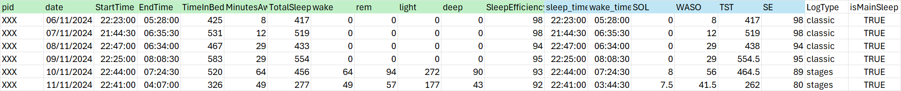
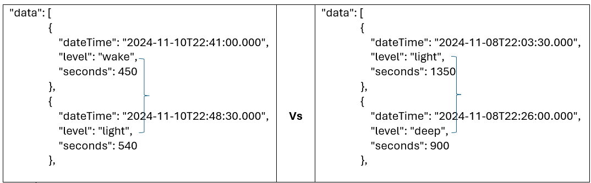
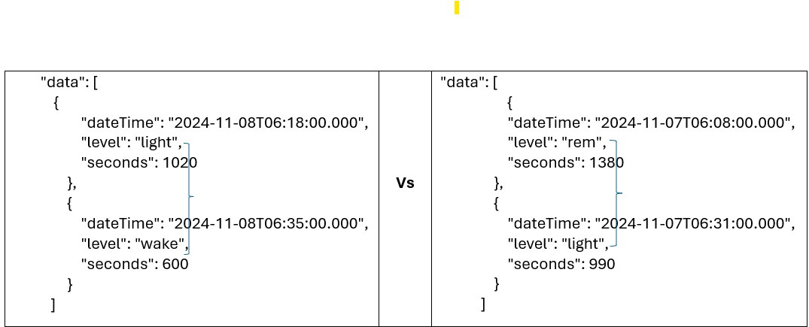

# Fitbit Data Collector

This is a Python package that automate Fitbit OAuth2 authorisation and collect sleep, activity and heart rate data from fitbit devices 

# Features
- OAth2-based Fitbit authentication (per participant)
- Participant information supplied in a CSV file
- Device-to-participant assignment and session tracking
- Sleep, activity and heart rate data collection
- Save Sleep, activity and heart rate to csv

# project structure
FitbitDataPipeline
- fitbit_pipeline
  - Classes
  - runner
  - Utility
- logs/ # application logs
- processed_data: Folder containing the pipeline output - Sleep Summary, Sleep Staging, Activity and Heartrate data
- raw_sleep_data : raw sleep json file from Fitbit Web API 
- tokens : Locally managed Fitbit user tokens
- app_server - Flask app for the Fitbit OAuth2
- auth_code - Application generated for the exchange of the redirect url after authentication
- config - contain some user configurations and fitbit WebAPI endpoint URLs
- License 
- participants.csv 
- readme - This file
- requirements : Required packages to successfully run the application
- 
# Requirement
Aside the packages required as specified in the requirements file. The following are also needed to run this pipeline
- Core - Python 3.8+
- Fitbit developer account
- API client ID and secret 
(ensure intraday data access is enabled using require a separate application)

# Getting Started
The application is into two parts: Flask application for Fitbit Authentication and the main pipeline 
1. Add the participant file (participants.csv) to the project root folder with the following structure:

############# participants file ##################################
pid,age,fitbit_id,device_model,study_period,collection_dates
ABC02,10,Z4XX11,Inspire 3,"2024-11-05,2024-11-13",2024-11-05;2024-11-06;2024-11-07;2024-11-08;2024-11-09;2024-11-10;2024-11-11;2024-11-12;2024-11-13
###################################################################

2. create .env file and populate it with your fitbit developer account client id and secret
############### .env file ###################################
client_id = "XXXXX"
client_secret = "xxxxxxxxxxxxxxxxxxxxxxxxxxxxx"
##############################################################

3.  Start the app_server using python app.py
# Output Files
- all_sleep_data :
....fig 1
The light green background columns are out-of-the-box while the light blue category are derived. Detailed as follows:
  SOL - I looked at first sleep staging , if the first sleep staging is wake then followed by any of light, deep or REM then there is SOL, otherwise, no SOL
  .....fig 2
  WASO = MinutesAwake - SOL (Fitbit claimed that raw minutes awake does not include awake before first sleep episode or after wakeup)
- sleep_time - From fig 2 above the sample from the left had the SOL hence differentiating "StartTime" from "sleep_time"
- wake_time - Checking the last two entry in the sleep staging could give an idea of actual wake time. If the last episode is wake, most likely, the participant spend some time in bed after wake
- 
- TST = time_diff(sleep_time, wake_time) - WASO
- SE = TST/TimeInBed * 100 
Note: Fitbit advised that only SE from "classic log type" is valid and this should be ignored for stages log type (even though a value will be provided)
# License
This project is licensed under the MIT License

# Contributing
Pull request are highly welcome! Please open an issue first to discuss your idea

# Contact
For questions or support, reach out to: abiola.saka@bristol.ac.uk or sakbioonline@gmail.com